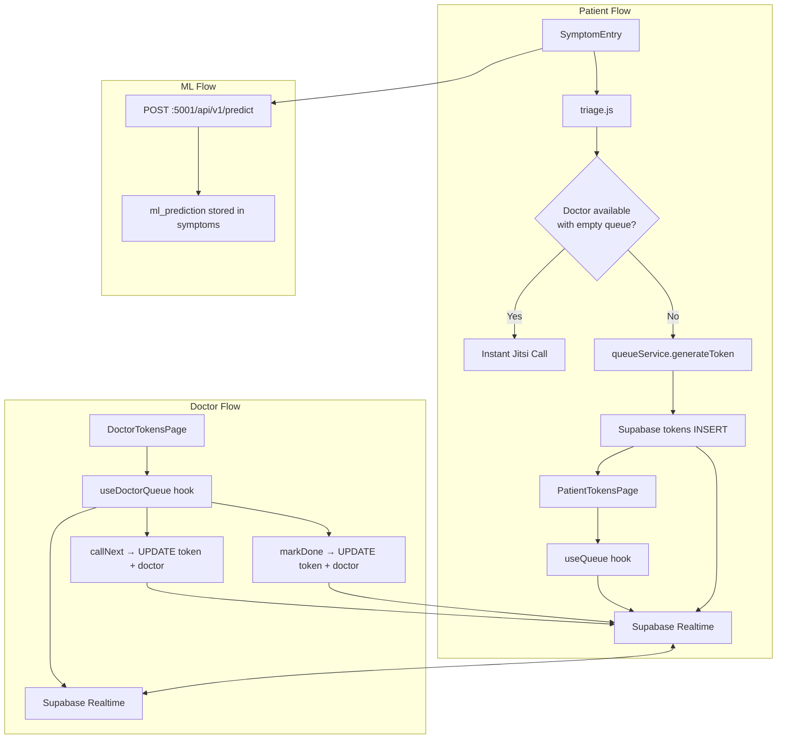

# Design Document: realtime-token-queue

## Overview

The `realtime-token-queue` feature replaces all hardcoded and mock token logic in Digital Chikitsak with a fully live, Supabase-backed queue system. Patients submit symptoms (voice or text), receive a triage priority, and are either placed in a real-time queue or connected instantly to an available doctor. Doctors manage their availability and advance the queue with a single action. All state changes propagate to every connected client within 2 seconds via Supabase Realtime — no polling required.

The system is composed of four layers:

1. **Supabase** — PostgreSQL schema + Realtime publication (source of truth)
2. **Frontend services** — `queueService.js`, `triage.js` (pure logic, no I/O)
3. **React hooks** — `useQueue`, `useDoctorQueue` (Realtime subscriptions)
4. **React pages** — `PatientTokensPage`, `DoctorTokensPage`, `SymptomEntry` (UI)

The Flask backend at `:5000` handles auth only. The ML predictor at `:5001` is called client-side for symptom analysis. All token and queue operations go directly to Supabase.

---

## Architecture



**Key design decisions:**

- Token generation and queue queries run directly against Supabase from the client, protected by Row Level Security (RLS). No Flask proxy needed for queue operations.
- The triage engine (`triage.js`) is a pure function — no network calls, runs synchronously before any async work.
- ML API is called with a 10-second timeout; failure falls back gracefully to raw symptom list.
- Jitsi room IDs are deterministic: `chikitsak-{token_id}`. No room registry needed.

---

## Components and Interfaces

### `triage.js`

Pure function, no side effects.

```js
/**
 * @param {{ symptoms: string[], age: number }} input
 * @returns {{ priority: 'emergency'|'senior'|'child'|'general', severity: 'critical'|'high'|'normal' }}
 */
export function triage({ symptoms, age })
```

Rules evaluated in order (first match wins):
1. `symptoms` includes both `chest_pain` AND `shortness_breath` → `{ priority: 'emergency', severity: 'critical' }`
2. `age > 60` → `{ priority: 'senior', severity: 'high' }`
3. `age < 12` → `{ priority: 'child', severity: 'high' }`
4. else → `{ priority: 'general', severity: 'normal' }`

### `queueService.js`

All functions are async and interact with Supabase directly.

```js
// Token generation
generateToken({ patientId, priority })
  → Promise<TokenRecord>          // throws 409 if active token exists, 503 if no doctors online

// Queue queries
getQueuePosition(tokenId, doctorId, myTokenNumber)
  → Promise<{ position: number, estimatedWait: number }>

getEstimatedWait(position, avgConsultTime = 10)
  → number                        // pure: position * avgConsultTime

getDoctorQueue(doctorId)
  → Promise<TokenRecord[]>        // sorted by priority then token_number

// Doctor actions
callNext(doctorId)
  → Promise<TokenRecord>          // throws if queue empty

markDone(tokenId, doctorId)
  → Promise<void>

updateDoctorStatus(doctorId, status)
  → Promise<void>
```

### `useQueue(doctorId, myTokenId)` hook

```js
// Returns
{
  queue: TokenRecord[],           // full waiting queue for doctor
  myPosition: number,             // 0-indexed position of patient's token
  estimatedWait: number,          // minutes
  isMyTurn: boolean,              // true when myToken.status === 'in_consultation'
  jitsiRoomId: string | null,     // set when isMyTurn
  loading: boolean,
  error: string | null
}
```

Subscribes to `tokens` table filtered by `doctor_id`. Unsubscribes on unmount.

### `useDoctorQueue(doctorId)` hook

```js
// Returns
{
  queue: TokenRecord[],           // waiting tokens sorted by priority then token_number
  doctorStatus: DoctorStatus,
  callNext: () => Promise<void>,
  markDone: (tokenId) => Promise<void>,
  setStatus: (status) => Promise<void>,
  loading: boolean,
  error: string | null
}
```

Subscribes to both `tokens` and `doctors` tables filtered by `doctor_id`. Unsubscribes on unmount.

### `SymptomEntry` component

```
Props: { patientId, patientAge, onComplete(tokenRecord | jitsiRoomId) }

Internal state machine:
  idle → recording/typing → confirming → saving → calling_ml → deciding → done
```

Steps:
1. Voice (Web Speech API, `pa-IN → hi-IN → en-IN` fallback) or text input
2. Keyword extraction from free text → symptom array
3. Confirmation UI showing extracted symptoms before saving
4. `supabase.from('symptoms').insert(...)` 
5. `POST http://localhost:5001/api/v1/predict` with 10s timeout
6. On success: store `ml_prediction` in symptoms row
7. On failure: proceed with raw symptom list
8. Call `triage({ symptoms, age })` → priority
9. Check doctor availability → instant call or token generation

### `PatientTokensPage` (`/patient/tokens`)

Renders:
- Token number + priority badge
- Live position in queue + estimated wait
- "Your Turn" banner + "Join Call" button when `status = 'in_consultation'`
- Doctor availability indicator

Uses `useQueue` hook. No polling.

### `DoctorTokensPage` (`/doctor/tokens`)

Renders:
- Status toggle: `online / break / offline`
- Queue table: token_number, patient name, priority badge, status
- "Call Next" button (disabled when queue empty or doctor `in_call`)
- "Mark Done" button (visible when doctor `in_call`)
- "Join Call" button when `in_call`

Uses `useDoctorQueue` hook. No polling.

---

## Data Models

### Enums

```sql
CREATE TYPE doctor_status AS ENUM ('online', 'in_call', 'offline', 'break');
CREATE TYPE token_status  AS ENUM ('waiting', 'in_consultation', 'done');
CREATE TYPE priority_level AS ENUM ('emergency', 'senior', 'child', 'general');
```

### Tables

```sql
-- Doctors (one row per registered doctor)
CREATE TABLE doctors (
  id                 UUID PRIMARY KEY DEFAULT gen_random_uuid(),
  name               TEXT NOT NULL,
  status             doctor_status NOT NULL DEFAULT 'offline',
  current_patient_id UUID REFERENCES patients(id) ON DELETE SET NULL,
  created_at         TIMESTAMPTZ NOT NULL DEFAULT now()
);

-- Patients (one row per registered patient)
CREATE TABLE patients (
  id         UUID PRIMARY KEY DEFAULT gen_random_uuid(),
  name       TEXT NOT NULL,
  age        INTEGER,
  phone      TEXT UNIQUE NOT NULL,
  created_at TIMESTAMPTZ NOT NULL DEFAULT now()
);

-- Tokens (one row per queue entry)
CREATE TABLE tokens (
  id           UUID PRIMARY KEY DEFAULT gen_random_uuid(),
  token_number INTEGER NOT NULL,
  patient_id   UUID NOT NULL REFERENCES patients(id) ON DELETE CASCADE,
  doctor_id    UUID NOT NULL REFERENCES doctors(id) ON DELETE CASCADE,
  status       token_status NOT NULL DEFAULT 'waiting',
  priority     priority_level NOT NULL DEFAULT 'general',
  jitsi_room   TEXT,                          -- set when status = in_consultation
  created_at   TIMESTAMPTZ NOT NULL DEFAULT now(),
  called_at    TIMESTAMPTZ,
  UNIQUE (doctor_id, token_number)             -- token numbers unique per doctor
);

-- Symptoms (one row per symptom submission)
CREATE TABLE symptoms (
  id            UUID PRIMARY KEY DEFAULT gen_random_uuid(),
  patient_id    UUID NOT NULL REFERENCES patients(id) ON DELETE CASCADE,
  symptoms_json JSONB NOT NULL,
  ml_prediction TEXT,
  created_at    TIMESTAMPTZ NOT NULL DEFAULT now()
);
```

### Indexes

```sql
-- Queue fetch: filter by doctor + status, sort by token_number
CREATE INDEX idx_tokens_doctor_status ON tokens (doctor_id, status, token_number);

-- Active token check: find patient's active tokens
CREATE INDEX idx_tokens_patient_status ON tokens (patient_id, status);

-- Doctor availability query
CREATE INDEX idx_doctors_status ON doctors (status);
```

### Realtime Publication

```sql
-- Enable full row data in change events (required for Realtime filters)
ALTER TABLE tokens  REPLICA IDENTITY FULL;
ALTER TABLE doctors REPLICA IDENTITY FULL;
```

### Row Level Security

```sql
-- Patients can only see their own tokens
ALTER TABLE tokens ENABLE ROW LEVEL SECURITY;

CREATE POLICY "patients_own_tokens" ON tokens
  FOR SELECT USING (
    auth.uid() = patient_id
    OR EXISTS (
      SELECT 1 FROM doctors WHERE id = tokens.doctor_id AND id = auth.uid()
    )
  );

CREATE POLICY "patients_insert_own_tokens" ON tokens
  FOR INSERT WITH CHECK (auth.uid() = patient_id);

-- Doctors can update tokens in their queue
CREATE POLICY "doctors_update_queue_tokens" ON tokens
  FOR UPDATE USING (
    EXISTS (SELECT 1 FROM doctors WHERE id = tokens.doctor_id AND id = auth.uid())
  );

-- Patients can only see their own symptoms
ALTER TABLE symptoms ENABLE ROW LEVEL SECURITY;

CREATE POLICY "patients_own_symptoms" ON symptoms
  FOR ALL USING (auth.uid() = patient_id);

-- Doctors can read their own row; only they can update their status
ALTER TABLE doctors ENABLE ROW LEVEL SECURITY;

CREATE POLICY "doctors_read_all" ON doctors FOR SELECT USING (true);
CREATE POLICY "doctors_update_own" ON doctors
  FOR UPDATE USING (auth.uid() = id);
```

### TypeScript / JSDoc Types

```js
/**
 * @typedef {{ id: string, token_number: number, patient_id: string, doctor_id: string,
 *             status: 'waiting'|'in_consultation'|'done', priority: 'emergency'|'senior'|'child'|'general',
 *             jitsi_room: string|null, created_at: string, called_at: string|null }} TokenRecord
 *
 * @typedef {{ id: string, name: string, status: 'online'|'in_call'|'offline'|'break',
 *             current_patient_id: string|null }} DoctorRecord
 *
 * @typedef {{ id: string, patient_id: string, symptoms_json: object,
 *             ml_prediction: string|null, created_at: string }} SymptomRecord
 */
```

---

## Correctness Properties

*A property is a characteristic or behavior that should hold true across all valid executions of a system — essentially, a formal statement about what the system should do. Properties serve as the bridge between human-readable specifications and machine-verifiable correctness guarantees.*

### Property 1: Queue is always filtered and sorted correctly

*For any* set of tokens for a given `doctor_id` with mixed statuses and arbitrary `token_number` values, querying the doctor's queue SHALL return only tokens with `status = 'waiting'`, ordered ascending by `token_number`.

**Validates: Requirements 1.6, 3.5**

---

### Property 2: Token generator selects the doctor with the minimum waiting queue

*For any* set of online doctors with varying counts of waiting tokens, the token generator SHALL always assign the new token to the doctor whose waiting token count is strictly minimal. If multiple doctors tie, any of the tied doctors is acceptable.

**Validates: Requirements 2.1**

---

### Property 3: Token numbers are always unique per doctor and sequential

*For any* existing queue for a doctor, the newly generated `token_number` SHALL equal `MAX(existing token_numbers) + 1`, or `1` if the queue is empty. No two tokens for the same doctor SHALL share the same `token_number`.

**Validates: Requirements 2.2**

---

### Property 4: At most one active token per patient

*For any* patient who already has a token with `status = 'waiting'` or `status = 'in_consultation'`, any attempt to generate a new token SHALL be rejected with a 409 error, leaving the existing token unchanged.

**Validates: Requirements 2.5**

---

### Property 5: Queue position is always non-negative and correct

*For any* queue state, a patient's position SHALL equal the count of tokens with `status = 'waiting'` and `token_number` strictly less than the patient's own `token_number` for the same `doctor_id`. This value is always ≥ 0.

**Validates: Requirements 3.1**

---

### Property 6: Estimated wait time is always non-negative and proportional

*For any* non-negative integer position `p` and average consult time `t > 0`, the estimated wait SHALL equal `p × t`. The result is always ≥ 0.

**Validates: Requirements 3.2**

---

### Property 7: "Call Next" always transitions the lowest-priority-then-token_number waiting token

*For any* doctor queue with at least one waiting token, calling "Call Next" SHALL transition exactly the token with the highest priority (emergency first) and, within the same priority, the lowest `token_number` to `status = 'in_consultation'`. All other tokens remain unchanged.

**Validates: Requirements 5.3, 5.4**

---

### Property 8: "Mark Done" restores doctor to online with no current patient

*For any* token with `status = 'in_consultation'`, marking it done SHALL set `token.status = 'done'`, `doctor.current_patient_id = null`, and `doctor.status = 'online'`. The operation is idempotent: calling it twice produces the same final state.

**Validates: Requirements 5.5**

---

### Property 9: Symptom storage round-trip preserves data

*For any* valid symptom JSON object, inserting it into the `symptoms` table and then retrieving it by `id` SHALL return a record whose `symptoms_json` field is deeply equal to the original input.

**Validates: Requirements 6.1**

---

### Property 10: Jitsi room ID is always deterministic from token ID

*For any* valid UUID `token_id`, the generated Jitsi room ID SHALL equal the string `"chikitsak-" + token_id`. The function is pure and referentially transparent.

**Validates: Requirements 7.1**

---

### Property 11: Priority ordering is always respected in queue display

*For any* queue containing tokens of mixed priorities, the sorted output SHALL place all `emergency` tokens before all `senior` tokens, all `senior` before all `child` tokens, and all `child` before all `general` tokens. Within each priority group, tokens SHALL be ordered ascending by `token_number`.

**Validates: Requirements 9.1, 9.2**

---

### Property 12: Only online doctors are candidates for token assignment

*For any* set of doctors with mixed statuses (`online`, `offline`, `break`, `in_call`), the token generator SHALL only consider doctors with `status = 'online'` as candidates. Doctors with any other status SHALL never be assigned a new token.

**Validates: Requirements 8.4, 2.4**

---

## Error Handling

| Scenario | Behavior |
|---|---|
| No online doctors | `generateToken` throws `{ code: 503, message: 'No doctors available' }` |
| Patient already has active token | `generateToken` throws `{ code: 409, message: 'Active token exists' }` |
| ML API timeout (>10s) | Proceed with raw symptom array; log warning; `ml_prediction` stored as `null` |
| ML API non-2xx response | Same as timeout fallback |
| Supabase insert fails | Surface error to user via toast; do not navigate away |
| `callNext` on empty queue | `callNext` throws `{ code: 404, message: 'No patients waiting' }` |
| Voice recognition unsupported | Disable mic button; show text-only input |
| Voice recognition language error | Fallback chain: `pa-IN → hi-IN → en-IN` |
| Realtime subscription drops | Auto-reconnect handled by Supabase client; show "Reconnecting…" indicator |
| `markDone` called on non-in_consultation token | No-op with warning log; UI button is disabled in this state |

---

## Testing Strategy

### Unit Tests (Vitest)

Focus on pure functions and specific examples:

- `triage.js`: all four priority branches, boundary ages (12, 60, 11, 61), combined emergency symptoms
- `queueService.getEstimatedWait`: specific position/time combinations
- `queueService.getQueuePosition`: specific queue snapshots
- Priority sort comparator: specific ordering examples
- Jitsi room ID generation: specific UUID inputs
- Token number computation: empty queue, single-item queue, multi-item queue

### Property-Based Tests (fast-check)

Uses [fast-check](https://github.com/dubzzz/fast-check) — minimum 100 iterations per property.

Each test is tagged with a comment referencing the design property:
```
// Feature: realtime-token-queue, Property N: <property_text>
```

Properties to implement as PBT:

| Property | Test Description |
|---|---|
| P1: Queue filter+sort | Generate random token arrays, verify filter+sort output |
| P2: Min-queue doctor selection | Generate random doctor+queue-count maps, verify selection |
| P3: Token number uniqueness | Generate random existing queues, verify MAX+1 and uniqueness |
| P4: One active token per patient | Generate patient with active token, verify 409 on second attempt |
| P5: Position non-negative and correct | Generate random queues, verify position calculation |
| P6: Wait time proportional | Generate random (position, avgTime) pairs, verify arithmetic |
| P7: Call Next selects correct token | Generate random priority+token_number queues, verify selection |
| P8: Mark Done idempotence | Generate in_consultation tokens, verify state after markDone |
| P9: Symptom round-trip | Generate random symptom JSON objects, verify storage round-trip |
| P10: Jitsi room ID determinism | Generate random UUIDs, verify room ID format |
| P11: Priority ordering | Generate random mixed-priority queues, verify sort invariant |
| P12: Only online doctors selected | Generate random doctor status sets, verify only online selected |

### Integration Tests

- Supabase Realtime subscription established on mount
- Token insert triggers subscriber update within 2 seconds (using Supabase test client)
- Doctor status update broadcasts to subscribers
- ML API called with correct payload format
- RLS policies: patient cannot read another patient's tokens

### Smoke Tests

- All four tables exist with correct columns and types
- Enums have correct values
- Realtime publication enabled on `tokens` and `doctors`
- RLS enabled on all tables
